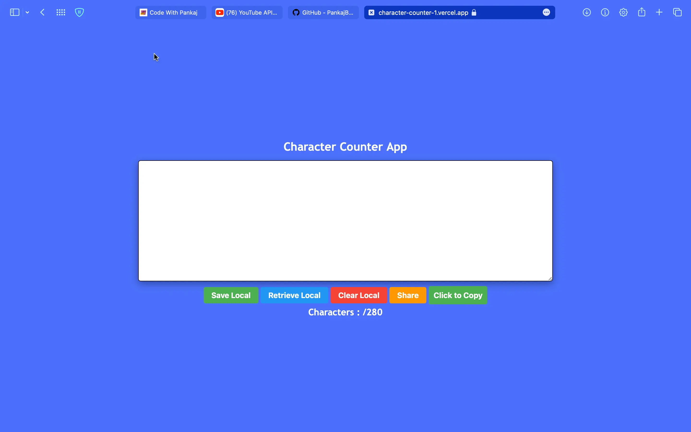

# Character Counter App

Character Counter App is the subject of this webpage. This project can be used to detect chat character limits. Your characters will not exceed 280, and you will be notified if they exceed it, you can save entered data to a local storage device, you can retrieve entered data from local storage, you can clear entered data to local storage, you can share entered data on social media, copy entered data to the clipboard, and the width of the device will be automatically fixed if you exceed the 280 character limit.

<hr>

💙 Join the channel to see more videos like this. [Code_With_Pankaj](https://www.youtube.com/c/CodeWithPankaj1?sub_confirmation=1)
<hr>

<div align=center>

## Must visit 👇 (Click on it)

[](https://www.youtube.com/c/CodeWithPankaj1?sub_confirmation=1)

</div>

<hr>

## Features

- Make a count of the characters entered.
- You will be notified if you exceed the 280 character limit.
- It is possible to save entered data to a local storage device.
- Local storage can be used to retrieve entered data.
- Clearing entered data to local storage is possible.
- Entered data can be shared on social media.
- Copying entered data to the clipboard is possible.
- The width of the device will be automatically fixed.


## Authors

- [@pankajbaliyan](https://www.github.com/pankajbaliyan)


## Contributing

Contributions are always welcome!

See `index.html` for ways to get started.

Please adhere to this project's `code of conduct`.


## Demo

https://character-counter-1.vercel.app
<br><br>
https://pankajbaliyan.github.io/Character-Counter/


## Feedback

If you have any feedback, please reach out to us at pankajbaliyan90@gmail.com


## 🔗 Links

[](https://www.linkedin.com/in/pankaj-kumar-90/)

<br>

[](https://codewithpankaj.vercel.app)

## Lessons Learned

I learned many things while making this repository, i.e. how to add events on every keyPress-up and how to save data in local storage and how to retrieve from their and many more.
## Run Locally

Clone the project

```bash
  git clone https://github.com/PankajBaliyan/Character-Counter.git
```

Go to the project directory

```bash
  cd Character-Counter
```

Start code editor

```bash
  code .
```


## Screenshots




## Support

For support, email pankajbaliyan90@gmail.com or join our Slack channel.